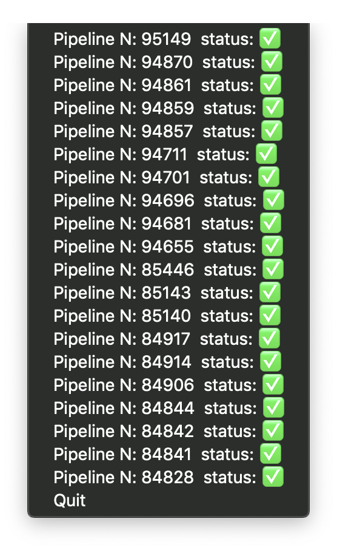
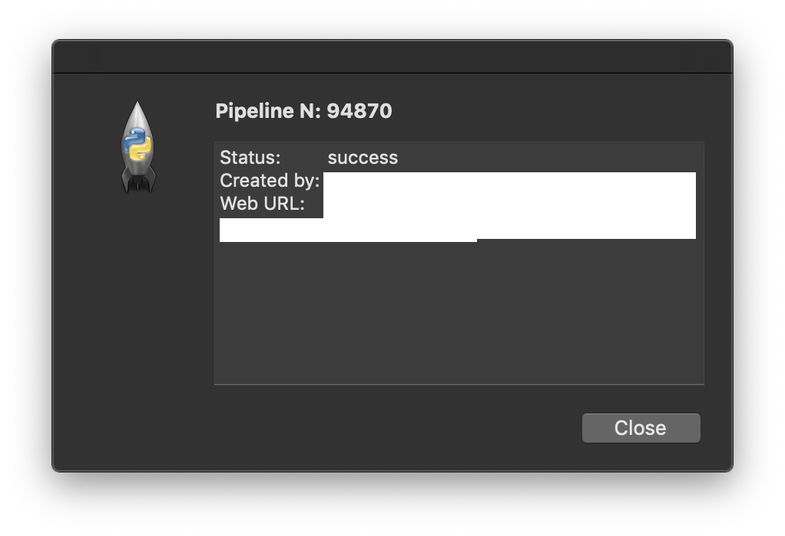

# pipeMonitor - A pipeline monitoring tool for gitlab

How to run the project

 1. Make sure you have Python3 installed properly
 2. `git clone git@github.com:andrearizzello/pipeMonitor.git`
 3. `cd pipeMonitor`
 4. `python3 main.py` to see the helper

# Screenshots

